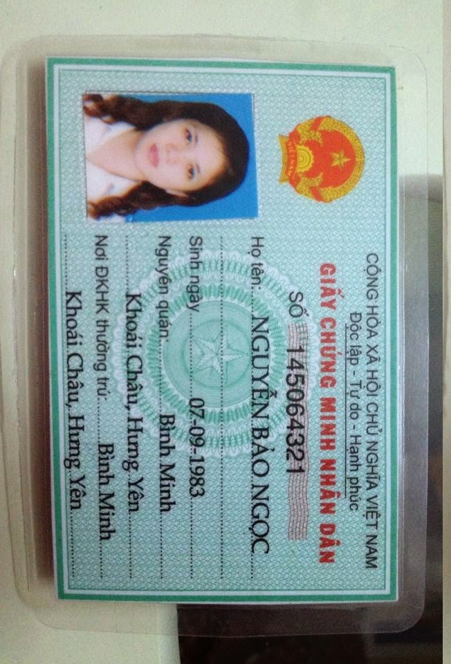
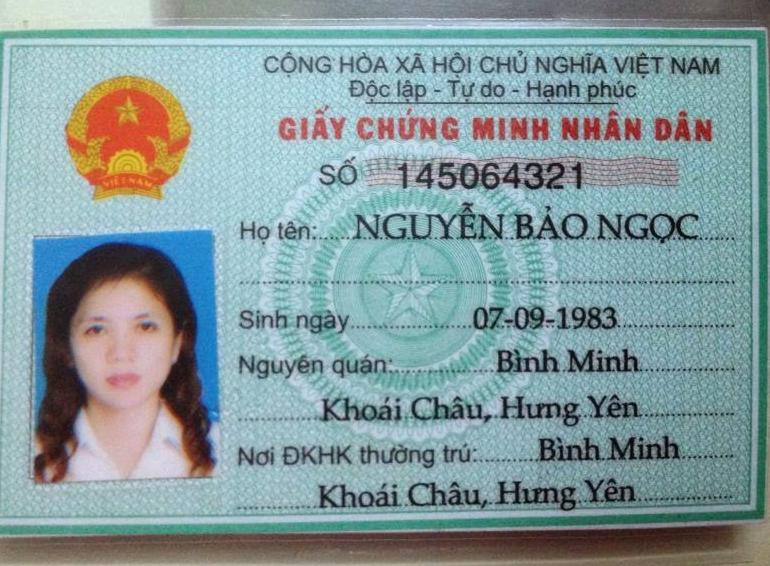
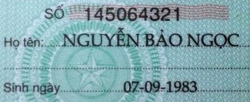

# vietnamese_id_auto_rotated_enhanced
The goal is auto rotate image and enhanced Vietnamese ID

##How to install:
####Step 1: Install Tensorflow Object Detection API

> git clone https://github.com/tensorflow/models.git

navigate a terminal console to the models/research/ folder and enter the command
>protoc object_detection/protos/*.proto --python_out=.

> export PYTHONPATH=$PYTHONPATH:`pwd`:`pwd`/slim 
 
Currently this project using: ssd_mobilenet_v2_quantized_300x300_coco pretrained model and fine-tuned with 50k steps. 

####Step 2: Usage

Sample usage:
> python image_crop_enhanced.py

##Sample:

Input: 

Output: 

For all ID: 

For only text we need: 